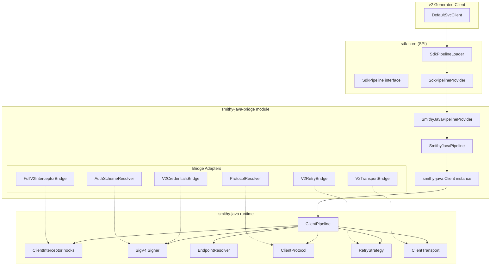
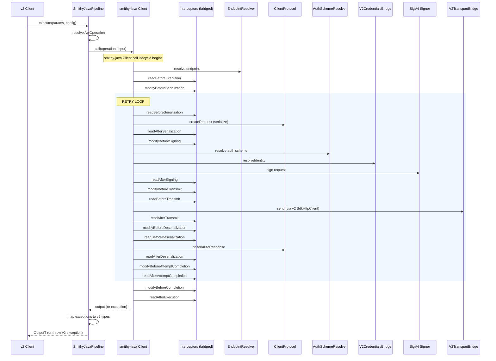
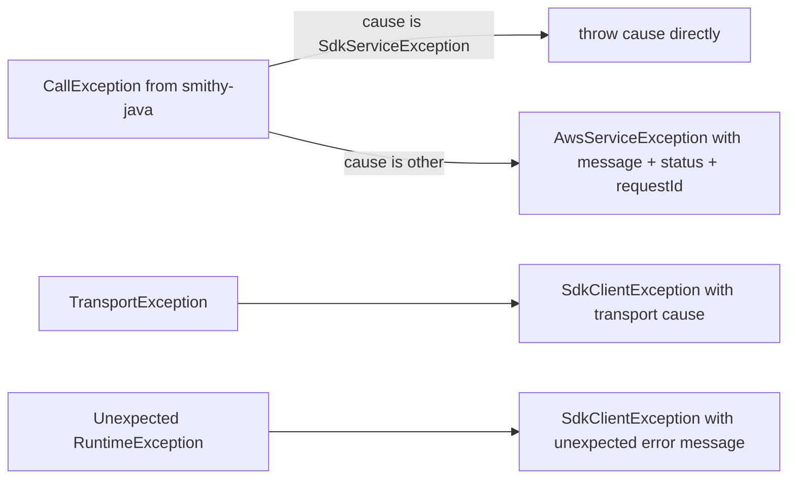

# Design Document: smithy-java Full Pipeline

## Overview

This design expands the existing `SmithyJavaPipeline` proof-of-concept (which only handles serialize→transport→deserialize for awsJson1_0) into a production-ready execution pipeline that matches smithy-java's `Client.call` lifecycle. The key architectural decision is to **delegate to smithy-java's own `Client` (or its internal `ClientPipeline`)** rather than re-implementing pipeline stages manually.

The expanded pipeline adds:
- **Identity resolution** via `V2CredentialsBridge` (wraps v2 `AwsCredentialsProvider`)
- **SigV4 request signing** via smithy-java's `aws-sigv4` signer
- **Auth scheme resolution** per-operation
- **Full interceptor pipeline** via `FullV2InterceptorBridge` (all 13 v2 hooks)
- **Endpoint resolution** via smithy-java's endpoint rules engine
- **Retry** via bridged v2 retry configuration
- **Multi-protocol support** (awsJson 1.0/1.1, restJson1, restXml, awsQuery, rpcV2Cbor)
- **Error mapping** (smithy-java exceptions → v2 SDK exceptions)

### Design Rationale: Delegation over Re-implementation

The stated goal is: *"The smithy-java pipeline should match as closely as possible (or use if we can) the smithy-java Client.call method."*

smithy-java's `Client.call()` already correctly implements:
- 17-hook interceptor pipeline with correct ordering (forward vs reverse for completion)
- Retry loop wrapping the correct stages
- Identity resolution + signing coordination
- Error propagation with suppressed exceptions in completion hooks

**Re-implementing these in the bridge would be fragile and would drift from smithy-java's behavior over time.** Instead, `SmithyJavaPipeline` constructs a smithy-java `Client` instance configured with bridged components, then delegates `execute()` to `Client.call()`.

## Architecture



### Pipeline Execution Flow (via smithy-java Client.call)



## Components and Interfaces

### Existing Components (Kept As-Is)

| Class | Role |
|-------|------|
| `V2TransportBridge` | Wraps v2 `SdkHttpClient` as smithy-java `ClientTransport<HttpRequest, HttpResponse>` |
| `SmithyJavaPipelineProvider` | SPI provider; priority 0; creates `SmithyJavaPipeline` |
| `SdkPipeline` (in `sdk-core`) | SPI interface for pipeline implementations |

### Expanded Component: SmithyJavaPipeline

The current POC is rewritten to delegate to a smithy-java `Client` instance.

```java
@SdkInternalApi
final class SmithyJavaPipeline implements SdkPipeline {

    private final Client smithyClient;
    private final SdkClientConfiguration clientConfiguration;
    private final ConcurrentMap<String, ApiOperation<?, ?>> operationCache;

    SmithyJavaPipeline(SdkClientConfiguration clientConfiguration) {
        this.clientConfiguration = clientConfiguration;
        this.operationCache = new ConcurrentHashMap<>();
        this.smithyClient = buildSmithyClient(clientConfiguration);
    }

    @Override
    public <InputT extends SdkRequest, OutputT extends SdkResponse> OutputT execute(
            ClientExecutionParams<InputT, OutputT> executionParams,
            SdkClientConfiguration clientConfiguration) {
        // 1. Resolve ApiOperation
        // 2. Delegate to smithyClient.call(operation, input)
        // 3. Map result back to OutputT
        // 4. Map exceptions to v2 types
    }

    @Override
    public <InputT extends SdkRequest, OutputT extends SdkResponse> boolean supportsOperation(
            ClientExecutionParams<InputT, OutputT> executionParams) {
        // Check: input instanceof SerializableStruct
        // Check: ApiOperation class loadable
        // Check: not a streaming operation
    }

    private Client buildSmithyClient(SdkClientConfiguration config) {
        // Extract v2 config and construct smithy-java Client with:
        // - V2TransportBridge (from SYNC_HTTP_CLIENT)
        // - V2CredentialsBridge (from CREDENTIALS_PROVIDER)
        // - FullV2InterceptorBridge instances (from EXECUTION_INTERCEPTORS)
        // - EndpointResolver (from CLIENT_ENDPOINT_PROVIDER or rules engine)
        // - Retry config (from RETRY_STRATEGY/RETRY_POLICY)
        // - Region + signing name for auth
        // - ProtocolResolver for multi-protocol
    }
}
```

### New Component: V2CredentialsBridge

**Package:** `software.amazon.awssdk.bridge.smithyjava.auth`

Wraps a v2 `AwsCredentialsProvider` as a smithy-java `AwsCredentialsResolver`.

```java
@SdkInternalApi
public final class V2CredentialsBridge implements AwsCredentialsResolver {

    private final AwsCredentialsProvider v2Provider;

    public V2CredentialsBridge(AwsCredentialsProvider v2Provider) {
        this.v2Provider = Objects.requireNonNull(v2Provider, "v2Provider");
    }

    @Override
    public Class<AwsCredentialsIdentity> identityType() {
        return AwsCredentialsIdentity.class;
    }

    @Override
    public IdentityResult<AwsCredentialsIdentity> resolveIdentity(Context properties) {
        try {
            AwsCredentials v2Creds = v2Provider.resolveCredentials();
            AwsCredentialsIdentity identity = toSmithyIdentity(v2Creds);
            return IdentityResult.of(identity);
        } catch (Exception e) {
            throw SdkClientException.builder()
                .message("Failed to resolve credentials via v2 provider: " + e.getMessage())
                .cause(e)
                .build();
        }
    }

    private static AwsCredentialsIdentity toSmithyIdentity(AwsCredentials v2Creds) {
        if (v2Creds instanceof AwsSessionCredentials session) {
            return AwsCredentialsIdentity.builder()
                .accessKeyId(session.accessKeyId())
                .secretAccessKey(session.secretAccessKey())
                .sessionToken(session.sessionToken())
                .build();
        }
        return AwsCredentialsIdentity.create(
            v2Creds.accessKeyId(),
            v2Creds.secretAccessKey());
    }
}
```

### New Component: FullV2InterceptorBridge

**Package:** `software.amazon.awssdk.bridge.smithyjava.interceptors`

Replaces the existing `V2InterceptorBridge` (4 hooks) with a complete 13-hook mapping.

```java
@SdkInternalApi
public final class FullV2InterceptorBridge implements ClientInterceptor {

    private final ExecutionInterceptor v2Interceptor;
    private final ExecutionAttributes sharedAttributes;

    public FullV2InterceptorBridge(ExecutionInterceptor v2Interceptor) {
        this.v2Interceptor = v2Interceptor;
        this.sharedAttributes = new ExecutionAttributes();
    }

    // -- Forward hooks (registration order) --

    @Override
    public void readBeforeExecution(InputHook<?, ?> hook) {
        // Build Context.BeforeExecution from hook, call v2Interceptor.beforeExecution(ctx, attrs)
    }

    @Override
    public <InputT> InputT modifyBeforeSerialization(InputHook<?, InputT> hook) {
        // Build Context.ModifyRequest, call v2Interceptor.modifyRequest(ctx, attrs)
        // Return potentially modified SdkRequest
    }

    @Override
    public void readBeforeSerialization(InputHook<?, ?> hook) {
        // Build Context.BeforeMarshalling, call v2Interceptor.beforeMarshalling(ctx, attrs)
    }

    @Override
    public void readAfterSerialization(RequestHook<?, ?, ?> hook) {
        // Build Context.AfterMarshalling, call v2Interceptor.afterMarshalling(ctx, attrs)
    }

    @Override
    public <RequestT> RequestT modifyBeforeSigning(RequestHook<?, ?, RequestT> hook) {
        // Build Context.ModifyHttpRequest, call v2Interceptor.modifyHttpRequest(ctx, attrs)
        // Return potentially modified SdkHttpRequest
    }

    @Override
    public void readBeforeTransmit(RequestHook<?, ?, ?> hook) {
        // Build Context.BeforeTransmission, call v2Interceptor.beforeTransmission(ctx, attrs)
    }

    @Override
    public void readAfterTransmit(ResponseHook<?, ?, ?, ?> hook) {
        // Build Context.AfterTransmission, call v2Interceptor.afterTransmission(ctx, attrs)
    }

    @Override
    public <ResponseT> ResponseT modifyBeforeDeserialization(ResponseHook<?, ?, ?, ResponseT> hook) {
        // Build Context.ModifyHttpResponse, call v2Interceptor.modifyHttpResponse(ctx, attrs)
        // Return potentially modified SdkHttpResponse
    }

    @Override
    public void readBeforeDeserialization(ResponseHook<?, ?, ?, ?> hook) {
        // Build Context.BeforeUnmarshalling, call v2Interceptor.beforeUnmarshalling(ctx, attrs)
    }

    @Override
    public void readAfterDeserialization(OutputHook<?, ?, ?, ?> hook) {
        // Build Context.AfterUnmarshalling, call v2Interceptor.afterUnmarshalling(ctx, attrs)
    }

    // -- Completion hooks (reverse registration order) --

    @Override
    public <OutputT> OutputT modifyBeforeCompletion(OutputHook<?, OutputT, ?, ?> hook) {
        // Build Context.ModifyResponse, call v2Interceptor.modifyResponse(ctx, attrs)
    }

    @Override
    public void readAfterExecution(OutputHook<?, ?, ?, ?> hook, RuntimeException error) {
        if (error == null) {
            // Build Context.AfterExecution, call v2Interceptor.afterExecution(ctx, attrs)
        } else {
            // Build Context.FailedExecution, call v2Interceptor.onExecutionFailure(ctx, attrs)
        }
    }

    @Override
    public Throwable modifyBeforeAttemptCompletion(
            OutputHook<?, ?, ?, ?> hook, Throwable error) {
        // Build Context.FailedExecution, call v2Interceptor.modifyException(ctx, attrs)
        // Return potentially modified exception
    }
}
```

**Context Adaptation Strategy:**

The `FullV2InterceptorBridge` must convert between smithy-java hook contexts (`InputHook`, `RequestHook`, `ResponseHook`, `OutputHook`) and v2 `Context.*` objects. The adaptation:

1. Extracts the `SdkRequest` from the smithy-java input (since the input IS the `SdkRequest` — it implements both `SdkRequest` and `SerializableStruct`).
2. Converts `HttpRequest`/`HttpResponse` between smithy-java and v2 representations using header/body adapters.
3. Maintains a shared `ExecutionAttributes` instance across all hooks in a single execution, pre-populated with `SdkExecutionAttribute.OPERATION_NAME` and `SdkExecutionAttribute.SERVICE_NAME`.

### New Component: V2RetryBridge

**Package:** `software.amazon.awssdk.bridge.smithyjava.retry`

Bridges v2 retry configuration to smithy-java's retry mechanism.

```java
@SdkInternalApi
public final class V2RetryBridge {

    /**
     * Creates a smithy-java RetryStrategy from v2 client configuration.
     * Falls back to standard retry (3 attempts) if no explicit config is present.
     */
    public static software.amazon.smithy.java.retries.RetryStrategy fromV2Config(
            SdkClientConfiguration config) {
        RetryStrategy v2Strategy = config.option(SdkClientOption.RETRY_STRATEGY);
        if (v2Strategy != null) {
            return bridgeStrategy(v2Strategy);
        }
        RetryPolicy v2Policy = config.option(SdkClientOption.RETRY_POLICY);
        if (v2Policy != null) {
            return bridgePolicy(v2Policy);
        }
        // Default: standard retry with 3 max attempts
        return defaultStandardRetry();
    }

    private static software.amazon.smithy.java.retries.RetryStrategy bridgeStrategy(
            RetryStrategy v2Strategy) {
        // Map max attempts, backoff strategy, retry predicates
        // to smithy-java equivalents
    }
}
```

### New Component: ProtocolResolver

**Package:** `software.amazon.awssdk.bridge.smithyjava.protocol`

Resolves the correct `ClientProtocol` implementation from the service schema's protocol trait.

```java
@SdkInternalApi
public final class ProtocolResolver {

    private static final ShapeId AWS_JSON_1_0 = ShapeId.from("aws.protocols#awsJson1_0");
    private static final ShapeId AWS_JSON_1_1 = ShapeId.from("aws.protocols#awsJson1_1");
    private static final ShapeId REST_JSON_1 = ShapeId.from("aws.protocols#restJson1");
    private static final ShapeId REST_XML = ShapeId.from("aws.protocols#restXml");
    private static final ShapeId AWS_QUERY = ShapeId.from("aws.protocols#awsQuery");
    private static final ShapeId RPC_V2_CBOR = ShapeId.from("smithy.protocols#rpcv2Cbor");

    /**
     * Resolves the ClientProtocol for the given service shape ID by examining
     * which protocol trait the service schema carries.
     *
     * @throws SdkClientException if no recognized protocol trait is found
     */
    public static ClientProtocol<HttpRequest, HttpResponse> resolve(
            ApiOperation<?, ?> operation) {
        ShapeId serviceId = operation.service().schema().id();
        // Examine traits on the service schema to select protocol
        // Return cached protocol instance per service
    }
}
```

### New Component: AuthSchemeResolver

**Package:** `software.amazon.awssdk.bridge.smithyjava.auth`

Resolves which auth scheme + signer to use per-operation.

```java
@SdkInternalApi
public final class AuthSchemeResolver {

    /**
     * Resolves the effective auth scheme for an operation by iterating
     * the operation's effectiveAuthSchemes() list and selecting the first
     * scheme with a registered signer.
     *
     * @return the selected auth scheme configuration
     * @throws SdkClientException if no supported auth scheme is found
     */
    public static AuthSchemeConfig resolve(
            ApiOperation<?, ?> operation,
            Map<ShapeId, SignerConfig> registeredSigners) {
        List<ShapeId> schemes = operation.effectiveAuthSchemes();
        for (ShapeId scheme : schemes) {
            if (registeredSigners.containsKey(scheme)) {
                return new AuthSchemeConfig(scheme, registeredSigners.get(scheme));
            }
        }
        throw SdkClientException.builder()
            .message("No supported auth scheme found for operation. "
                     + "Available schemes: " + schemes)
            .build();
    }
}
```

**Note on AuthSchemeResolver:** When delegating to smithy-java's `Client.call()`, auth scheme resolution is handled internally by the smithy-java runtime. The `AuthSchemeResolver` component is primarily responsible for ensuring the correct signers and identity resolvers are registered on the `Client` at construction time, rather than being invoked per-request. The smithy-java `Client` builder accepts auth scheme configurations that map scheme IDs to signers + identity resolvers.

## Data Models

### Configuration Extraction from SdkClientConfiguration

When `SmithyJavaPipeline` is constructed, it extracts the following from the v2 `SdkClientConfiguration`:

| v2 Config Key | Extracted As | Used For |
|---|---|---|
| `SdkClientOption.SYNC_HTTP_CLIENT` | `SdkHttpClient` | Wrapped in `V2TransportBridge` |
| `AwsClientOption.CREDENTIALS_PROVIDER` | `AwsCredentialsProvider` | Wrapped in `V2CredentialsBridge` |
| `SdkClientOption.EXECUTION_INTERCEPTORS` | `List<ExecutionInterceptor>` | Each wrapped in `FullV2InterceptorBridge` |
| `SdkClientOption.RETRY_STRATEGY` | `RetryStrategy` | Bridged via `V2RetryBridge` |
| `SdkClientOption.RETRY_POLICY` | `RetryPolicy` | Bridged via `V2RetryBridge` (fallback) |
| `SdkClientOption.CLIENT_ENDPOINT_PROVIDER` | `ClientEndpointProvider` | Static endpoint override or rules engine |
| `AwsClientOption.AWS_REGION` | `Region` | Signing region + endpoint params |
| `AwsClientOption.SERVICE_SIGNING_NAME` | `String` | SigV4 signing scope |

### smithy-java Client Construction

The `SmithyJavaPipeline` constructs a smithy-java `Client` with:

```java
Client.builder()
    .transport(new V2TransportBridge(v2HttpClient))
    .addIdentityResolver(new V2CredentialsBridge(v2CredentialsProvider))
    .endpointResolver(endpointResolver)  // static or rules-engine-based
    .putConfig(RegionSetting.REGION, region.id())
    // Register all bridged interceptors
    .addInterceptor(new FullV2InterceptorBridge(interceptor1))
    .addInterceptor(new FullV2InterceptorBridge(interceptor2))
    // Auth scheme configuration (SigV4 with credentials resolver)
    .putConfig(AuthSetting.AUTH_SCHEMES, sigv4AuthScheme)
    // Protocol selection happens per-call via the operation's service schema
    .build();
```

### Exception Mapping Model



### Protocol Trait to Implementation Mapping

| Protocol Trait ShapeId | ClientProtocol Implementation |
|---|---|
| `aws.protocols#awsJson1_0` | `AwsJson1Protocol` |
| `aws.protocols#awsJson1_1` | `AwsJson1_1Protocol` |
| `aws.protocols#restJson1` | `RestJson1Protocol` |
| `aws.protocols#restXml` | `RestXmlProtocol` |
| `aws.protocols#awsQuery` | `AwsQueryProtocol` |
| `smithy.protocols#rpcv2Cbor` | `RpcV2CborProtocol` |

## Correctness Properties

*A property is a characteristic or behavior that should hold true across all valid executions of a system — essentially, a formal statement about what the system should do. Properties serve as the bridge between human-readable specifications and machine-verifiable correctness guarantees.*

### Property 1: Credential Round-Trip Preservation

*For any* v2 `AwsCredentials` (basic or session) with arbitrary `accessKeyId`, `secretAccessKey`, and optional `sessionToken` values, the `V2CredentialsBridge.resolveIdentity()` SHALL produce an `AwsCredentialsIdentity` where `accessKeyId()`, `secretAccessKey()`, and (when present) `sessionToken()` are equal to the original v2 credential values.

**Validates: Requirements 1.2, 1.3**

### Property 2: Credential Resolution Error Wrapping

*For any* exception thrown by a v2 `AwsCredentialsProvider.resolveCredentials()`, the `V2CredentialsBridge` SHALL throw an `SdkClientException` whose `cause()` is the original exception and whose `message()` is non-null and non-empty.

**Validates: Requirements 1.4**

### Property 3: Signing Parameter Resolution (Most-Specific Wins)

*For any* signing context with a client-level `(region, serviceName)` pair and an optional endpoint-override `(overrideRegion, overrideServiceName)` pair, the pipeline SHALL use the override values when present, and the client-level defaults otherwise — the most specific available values always win.

**Validates: Requirements 2.2, 2.3**

### Property 4: Auth Scheme Selection Order

*For any* ordered list of auth scheme `ShapeId`s returned by `effectiveAuthSchemes()` where at least one has a registered signer, the `AuthSchemeResolver` SHALL select the **first** scheme in the list that has a registered signer, ignoring subsequent schemes.

**Validates: Requirements 3.4**

### Property 5: V2 Interceptor Hook Dispatch Fidelity

*For any* v2 `ExecutionInterceptor` and any smithy-java hook invocation during a request lifecycle, the `FullV2InterceptorBridge` SHALL dispatch to the corresponding v2 hook method with a context object containing the correct request/response state at that point in the pipeline, and mutations from `modify*` hooks SHALL be reflected in subsequent pipeline stages.

**Validates: Requirements 5.2, 5.3, 5.4, 5.5, 5.6, 5.7, 5.8, 5.9, 5.10, 5.11, 5.12, 5.13, 5.15**

### Property 6: ExecutionAttributes Shared Across Hooks

*For any* execution of a single request, all v2 interceptor hooks invoked through `FullV2InterceptorBridge` SHALL share the same `ExecutionAttributes` instance, such that an attribute set by an earlier hook is visible to all subsequent hooks within that execution.

**Validates: Requirements 5.14**

### Property 7: V2 Interceptor Exception Transparency

*For any* exception thrown by a v2 `ExecutionInterceptor` hook method, the `FullV2InterceptorBridge` SHALL propagate that exact exception to the smithy-java pipeline without wrapping it in an additional exception type.

**Validates: Requirements 5.16**

### Property 8: Endpoint Override Bypass

*For any* URI configured as an endpoint override via `SdkClientOption.CLIENT_ENDPOINT_PROVIDER`, the pipeline SHALL use that URI as the request endpoint for all operations, bypassing the endpoint rules engine entirely.

**Validates: Requirements 6.2**

### Property 9: Retry Configuration Bridge Preservation

*For any* v2 `RetryStrategy` with a given `maxAttempts()` value, the `V2RetryBridge` SHALL produce a smithy-java retry configuration with the same maximum attempt count.

**Validates: Requirements 7.2**

### Property 10: Protocol Trait Resolution

*For any* `ApiOperation` whose service schema carries exactly one of the six recognized protocol traits (`awsJson1_0`, `awsJson1_1`, `restJson1`, `restXml`, `awsQuery`, `rpcV2Cbor`), the `ProtocolResolver` SHALL return the corresponding `ClientProtocol` implementation, and subsequent calls for the same service SHALL return the same instance.

**Validates: Requirements 8.1, 8.2, 8.3, 8.4, 8.5, 8.6, 8.7, 8.9**

### Property 11: CallException Unwrapping

*For any* `CallException` thrown by the smithy-java runtime whose `getCause()` is an instance of `SdkServiceException` (or a subtype including `AwsServiceException`), the `SmithyJavaPipeline` SHALL throw the cause directly without additional wrapping.

**Validates: Requirements 9.1, 9.2**

### Property 12: Non-SDK CallException Mapping

*For any* `CallException` thrown by the smithy-java runtime whose `getCause()` is NOT an instance of `SdkServiceException`, the `SmithyJavaPipeline` SHALL throw an `AwsServiceException` whose `message()` equals the `CallException` message, whose `statusCode()` equals the HTTP status from the error response, and whose `cause()` is the `CallException`.

**Validates: Requirements 9.3**

### Property 13: Transport Exception Wrapping

*For any* `TransportException` or `IOException` thrown by the transport layer, the `SmithyJavaPipeline` SHALL throw an `SdkClientException` whose `cause()` is the original transport exception and whose `message()` contains the original exception's message.

**Validates: Requirements 9.4**

### Property 14: Request ID Extraction

*For any* error response containing an `x-amzn-RequestId` header value and/or an `x-amz-id-2` header value, the thrown `AwsServiceException` SHALL have `requestId()` set to the `x-amzn-RequestId` value and `extendedRequestId()` set to the `x-amz-id-2` value respectively.

**Validates: Requirements 9.5, 9.6**

### Property 15: Unsupported Operation Detection

*For any* `SdkRequest` input that does NOT implement `SerializableStruct`, or whose corresponding `ApiOperation` class cannot be loaded, the `SmithyJavaPipeline.supportsOperation()` SHALL return `false`.

**Validates: Requirements 10.3**

### Property 16: Interceptor Registration Order Preservation

*For any* ordered list of v2 `ExecutionInterceptor` instances from `SdkClientOption.EXECUTION_INTERCEPTORS`, the `SmithyJavaPipeline` SHALL register them as `FullV2InterceptorBridge` instances on the smithy-java `Client` in the same order, such that forward hooks execute in registration order and completion hooks in reverse registration order.

**Validates: Requirements 5.1**

## Error Handling

### Exception Hierarchy

The pipeline maps all smithy-java exceptions back to the v2 exception hierarchy:

1. **Modeled service errors** (e.g., `ResourceNotFoundException`): These already extend `AwsServiceException` via generated code. They are thrown directly after unwrapping from `CallException`.

2. **Unmodeled service errors**: When the protocol cannot match the error to a modeled type, an `AwsServiceException` is created with the HTTP status code, error message, and request ID.

3. **Client-side errors** (credential resolution, signing, endpoint resolution failures): Wrapped in `SdkClientException` with the cause preserved.

4. **Transport errors** (network failures, timeouts): Wrapped in `SdkClientException`.

### Error Flow

```
smithy-java throws CallException
  ├── cause instanceof AwsServiceException → throw cause directly
  ├── cause instanceof SdkServiceException → throw cause directly
  └── cause is other
      └── create AwsServiceException(message, statusCode, requestId, cause)

smithy-java throws TransportException
  └── create SdkClientException(message, cause)

V2CredentialsBridge catches exception from v2 provider
  └── create SdkClientException("Failed to resolve credentials", cause)

ProtocolResolver finds no recognized protocol trait
  └── create SdkClientException("Unsupported protocol")

AuthSchemeResolver finds no supported scheme
  └── create SdkClientException("No supported auth scheme")
```

### Interceptor Error Handling

When delegating to smithy-java's `Client.call()`, interceptor error handling follows smithy-java's built-in behavior:
- If a forward hook throws, remaining forward hooks are skipped, and completion hooks execute with the failure.
- If a completion hook throws during error propagation, the completion-hook exception is suppressed (added to the original failure's suppressed exceptions).
- v2 interceptor exceptions pass through `FullV2InterceptorBridge` unwrapped, so smithy-java sees and handles them natively.

## Testing Strategy

### Unit Tests

Unit tests verify individual bridge components in isolation:

- **V2CredentialsBridge**: Test with mock `AwsCredentialsProvider` returning basic/session credentials, null, and throwing exceptions.
- **FullV2InterceptorBridge**: Test each of the 13 hook mappings with mock `ExecutionInterceptor`, verifying correct context objects are built and mutations flow through.
- **V2RetryBridge**: Test mapping of v2 retry configs (max attempts, modes) to smithy-java equivalents.
- **ProtocolResolver**: Test trait-to-protocol mapping for all 6 protocols plus the error case.
- **AuthSchemeResolver**: Test selection logic with various ordered scheme lists.
- **Exception mapping**: Test all branches of the `CallException` → v2 exception mapping.

### Property-Based Tests

Property-based tests use **jqwik** (the standard PBT library for Java) with a minimum of 100 iterations per property.

Key property tests:
- **Credential round-trip**: Generate random (accessKeyId, secretAccessKey, sessionToken?) tuples, verify preservation through the bridge.
- **Auth scheme selection**: Generate random ordered lists of ShapeId with random signer availability, verify first-match selection.
- **Protocol resolution**: Generate service schemas with various protocol traits, verify correct mapping.
- **Exception mapping**: Generate CallExceptions with various cause types, verify correct v2 exception type is produced.
- **Request ID extraction**: Generate responses with random header values, verify they appear on the exception.
- **Interceptor order preservation**: Generate random-length interceptor lists, verify registration and execution order.

### Integration Tests

Integration tests verify the full pipeline end-to-end:

- Run against DynamoDB Local (existing demo pattern) to verify the complete flow: credentials → signing → serialize → transport → deserialize → response.
- Test with v2 `ExecutionInterceptor` instances that record hook invocations and verify the full 13-hook sequence.
- Test retry behavior with a mock server returning transient errors.
- Test with multiple protocols by targeting different services (DynamoDB for awsJson1_0, a REST JSON service, etc.).

### Test Configuration

- **PBT library**: jqwik 1.9.x (latest stable for JDK 21)
- **Minimum iterations**: 100 per property test
- **Tag format**: `Feature: smithy-java-full-pipeline, Property {N}: {description}`
